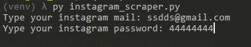
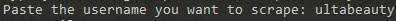
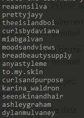
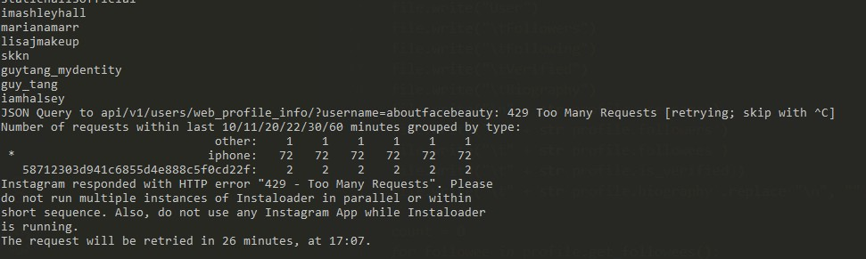

1. You need to install python:
This [link](https://www.geeksforgeeks.org/how-to-install-python-on-windows/ "link") explains well how to do it.

2. Install pip (program for install packages):
type this in the terminal `curl https://bootstrap.pypa.io/get-pip.py -o get-pip.py`
then type this `python get-pip.py`

3. Install all the requirements for the program:
type this in the terminal `pip install requirements.txt`

4. Run the program
Run the .exe file

You will get two messages:

Answer the respective data (be sure that your password doesn't have the ":" character)

Then, the terminal will prompt another message:

Paste the username of the account you want to scrape, and press enter.

The program will be scraping the user data, after that, will scrape information from the accounts that the user are following. The terminal will be prompt each followed account.

Note: instagram only allow to scrape 200 accounts (instagram policies), then you will need to wait 30 minutes aproximately, and then, scrape the data of other user.

When you see that error type `shift + C` two times.

After the program runs, you will have the file .csv in your folder
